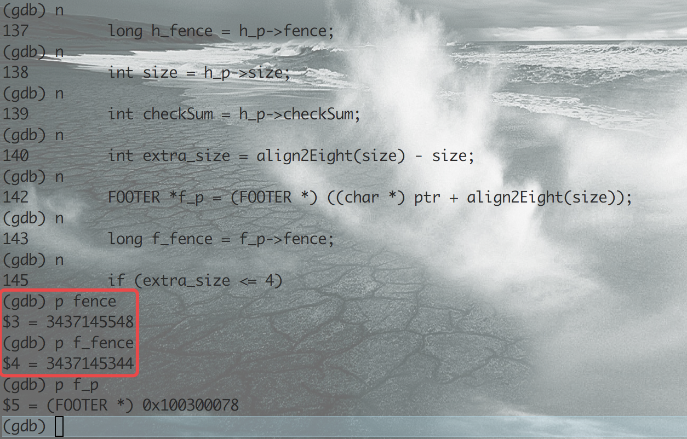

#SSD6 Exercise3学习报告

> 最近在系统级程序设计的实验课上，老师布置了这项作业，经过几天的尝试，终于做出来了。下面来简单的回顾一下这次作业。

###最终结果


###操作系统

* Macintosh

###Tips

* 在开始做之前，由于实在Mac下进行的编码，所以说要将driver.c中的`#include <windows.h>`改为`#include <unistd.h>`
* 接着开始编码

##具体流程

##1
根据`ex3.pdf`中`Implementation Details`中所描述的，我们需要把`memory block`设计成如下所述的结构


所以说，最开始的雏形就有了

```
int allocatedSize = 0;			//存储总共分配的大小

typedef struct Header HEADER;
struct Header{
	int checkSum;		//判断是否发生了 ERROR #3
	int size;		//存储MALLOC()中的大小
	long fence;	//存储0xCCDEADCC 作为判断是否发生ERROR #1 
};

typedef struct Footer FOOTER;
struct Footer{
	long fence;  //存储0xCCDEADCC 作为判断是否发生了ERROR #2
};

typedef struct Block BLOCK;
struct Block{
	HEADER h; //头部信息
	void *ptr; //Payload
	FOOTER f; //尾部信息
	char *filename;
	int linenumber;
	BLOCK *next;
}


```

##2

由于我们要为上述内容分配空间，所以说我们在进行如下操作

```
#define HEADERSIZE sizeof(HEADER)
#define FOOTERSIZE sizeof(FOOTER)
#define BLOCKSIZE sizeof(BLOCK)
#define BARRIER 0xCCDEADCC

```

##3

下面我们开始思考如何实现MyMalloc,它的函数原型如下

`void *MyMalloc(size_t size, char *filename, int linenumber)`

由于内存地址对齐，所以说根据这个题，我先写一个函数来让size为8的整数倍，多出来的内容需要用`BARRIER`填充

```
int align2Eight(int size)
{
	if( (size & 0x7) == 0)
	{
		return size;
	}
	else
	{
		return ((size >> 3) + 1) << 3;
	}
}
```

我的想法是先设定一个链表，存储BLOCK *,来管理这部分内容

所以说，我们这时候需要一个链表的头指针。

`BLOCK *block_list_header = NULL`

之后我们需要实现关于这个链表的`增、删、查`操作

查找最简单，所以我们先来实现查找

```
BLOCK *find_block(void *ptr)
{
	BLOCK *head = block_list_header;
	while(head)
	{
		if(head->ptr == ptr)
		{
			return head;
		}
		head = head->next;	
	}
	return NULL;	
}
```

然后我们需要实现增， 需要注意一点是由于BLOCK中包含`char *filename`，所以说别忘了为它分配内存和释放内存

```
int add_block(void *ptr, char *filename, int linenumber)
{
	//通过指针操作，来获取HEADER信息
	HEADER h = *((HEADER *)ptr - 1); 		//!注意 这里的-1操作其实是将ptr(地址值)减去了一个HEADERSIZE(16);
											// 如果你这样操作(char *)ptr - 1, 这样确实是让地址值减去了1。这里很关键，后面常用到
	int size = h->size;
	//通过指针操作获取FOOTER信息
	FOOTER f = *(FOOTER *)((char *)ptr + align2Eight(size));
	
	//为BLOCK分配内存
	BLOCK *curr = malloc(BLOCKSIZE);
	if(!BLOCK)
	{
		return -1;
	}
	//为filename分配内存
	int len = strlen(filename) + 1; 	//存储'\0'
	char *name = (char *)malloc((size_t)len);
	if(!name)
	{
		return -1;
	}
	strcpy(name, filename);
	
	curr->h = h;
	curr->ptr = ptr;
	curr->f = f;
	curr->filename = name;
	curr->linenumber = number;
	curr->next = block_list_header;
	block_list_header = curr;
	
	return 0;
}
```

最后来实现一下删操作

```
int remove_block(void *ptr)
{
	BLOCK *head = block_list_header;
	BLOCK *last; 		//存储需删除的上一个指针
	while(head)
	{
		if(head->ptr == ptr)
		{
			if(last)	//如果不是表头结点
			{
				last->next = head->next;
			}
			else
			{
				//挪动表头结点
				block_list_header = block_list_header->next;
			}
			free(head->filename);
			free(head);
			return 0;
		}
		last = head;
		head = head->next;
	}
	return -1;	
}
```

最后，来写一下求checkSum的函数

```
int get_check_number(long num)
{
    int count = 0;
    int standard = 0x1;
    int i;
    for(i = 0; i < sizeof(long); i++)
    {
        if((num & standard) == 1)
        {
            count ++;
        }
        num = num >> 1;
    }

    return count;
}

```

##4

到此为止，对于链表的基本操作都已经完成，下面我开始完成对`MyMalloc`函数的编写

```
void *MyMalloc(size_t size, char *filename, int linenumber) {
	char *header_begin;
	char *footer;
	HEADER h;
	FOOTER f;
	int extra_size; 		//内存对齐的填充大小
	long barrier = BARRIER:
	
	header_begin = (char *)malloc(HEADERSIZE + align2Eight((int)size) + FOOTERSIZE);
	if(!header_begin)
	{
		return NULL;
	}
	
	h.size = (int)size;
	h.fence = barrier;
	h.checkSum = get_check_number(h.size + h.fence);
	
	memcpy(header_begin, &h, HEADERSIZE);
	
	f.fence = barrier;
	footer = header_begin + HEADERSIZE + align2Eight(h.size);
	memcpy(footer, &f, FOOTERSIZE);
	
	//填充extra_size来判断是否越界
	extra_size = align2Eight(h.size) - h.size;
	if(extra_size <= 4)
	{
		strncpy(footer - extra_size, (char *) &barrier, (size_t)extra_size);
	}
	else
	{
		strncpy(footer - extra_size, (char *) &barrier, 4);
		strncpy(footer - extra_size + 4, (char *) &barrier, (size_t)(extra_size - 4));
	}
	
	if(add_block((void *)(header_begin + HEADERSIZE), filename, linenumber) == 0)
	{
		allocatedSize += h.size;
		return (void *)(header_begin + HEADERSIZE);
	}
	else
	{
		free(header_begin);
		return NULL;
	}
	
}

在实现MyFree(void *)之前，我们需要判断一下它是否有错误，所以说我们在写一个check_error(void *ptr)的函数。

int check_error(void *ptr)				//返回值为错误类型
{
	HEADER *h = (HEADER *)ptr - 1;
	long fence = BARRIER;
	int size = h->size;
	int checkSum = h->checkSum;
	long h_fence = h->fence;
	int extra_size = align2Eight(size) - size;
	
	FOOTER *f = (FOOTER *)(char *)ptr + align2Eight(size));
	long f_fence = f->fence;
	
	//先判断ERROR #2
	if (extra_size <= 4)
    {
        if(strncmp((char *)f - extra_size, (char *) &fence, (size_t)extra_size) != 0)
        {
            return 2;
        }
    }
    else{
        if(strncmp((char *)f - extra_size, (char *) &fence, 4) != 0
                || strncmp((char *)f - extra_size + 4, (char *)&fence, (size_t)(extra_size - 4)) != 0)
        {
            return 2;
        }
    }
    
    if(f_fence != BARRIER)
    {
    	return 2;
    }
   	 else if(h_fence != BARRIER)
   	 {
   	 	return 1;
   	 }
   	 else if(checkSum != get_check_number(size + h_fence))
   	 {
   	 	return 3;
   	 }
   	 
   	 return 0;
   
}


```

好了，我们最后来实现一下`MyFree(void *)`函数

```
void MyFree(void *ptr, char *filename, int linenumber) {
    int num;
    HEADER *h = (HEADER *)ptr - 1;
    BLOCK *curr = NULL;
    curr = find_block(ptr);
    if(!curr)
    {
        error(4, filename, linenumber);
    }
    else{
        num = check_block(ptr);
        if(num)
        {
            errorfl(num, curr->filename, curr->linenumber, filename, linenumber);
        }

        allocatedSize -= h->size;
        free(h);
        remove_block(ptr);
    }
}
```

##5

截止到目前，大部分都已经完成，最后再把Bonus实现，便大功告成。

```
/* returns number of bytes allocated using MyMalloc/MyFree:
	used as a debugging tool to test for memory leaks */
int AllocatedSize() {
    return allocatedSize;
}


/* Optional functions */

/* Prints a list of all allocated blocks with the
	filename/line number when they were MALLOC'd */
void PrintAllocatedBlocks() {
    BLOCK *curr = block_list_header;
    while(curr)
    {
        PRINTBLOCK(curr->h.size, curr->filename, curr->linenumber);
        curr=curr->next;
    }
}

/* Goes through the currently allocated blocks and checks
	to see if they are all valid.
	Returns -1 if it receives an error, 0 if all blocks are
	okay.
*/
int HeapCheck() {
    BLOCK *curr = block_list_header;
    int result = 0, err;
    while(curr)
    {
        err = check_block(curr->ptr);
        if(err)
        {
            result = -1;
            PRINTERROR(err, curr->filename, curr->linenumber);
        }
        curr = curr->next;
    }
    return result;
}

```

##Finish

OK, 到此为止，希望对你有帮助

##补充

###下面对一些具体的测试用例使用GDB调试观察地址及其内容

####Test case2


我们知道，字符串`str`在分配内存时应分配`8+1('\0')`大小的内存。所以说这个`BLOCK`中`Footer`里面的`fence`应该被改写了，让我们来看一些内存中的内容

```
//首先生成可用gdb调试的版本
gcc -g *.c -o debugmalloc

```

在检查出错的函数`check_block`加入断点


使用`-t`参数运行第二个测试用例


我们看到断点发生在`debugmalloc.c:135行`，此时`ptr`的地址值为`0x100300070`

**注意：**因为对`generic pointer(void *)`强制转化为`HEADER *`，并且`h_p = (HEADER *)ptr - 1`，这里面的-1实际上减去了`1 * sizeof(HEADER)`，也就是减去了`16`

我们继续用`n`来让程序继续往下单步运行



由于该用例只分配了8个内存，并且8是8的整数倍，不需要分配额外的内存来使内存对齐，所以说我们看到的`h_p`的地址为`0x100300078`，比`ptr`高`8`字节，但是`fence`的值和`f_fence`的值不同，说明尾部信息被篡改了，即分配内存不足，接下来让我们继续运行程序，得到相应的结果


符合上面的正确答案。

-------------------------------

再让我们看一个头部信息被改变的实例

####Test case6


先看下面这行代码


```
//把ptr低8字节的地址中的int数据改为 8 + (1 << 31);
*((int *)(ptr - 8)) = 8 + (1 << 31);

```

这时候我们再看我们最初定义的`Header`结构

```
struct Header{
	int checkSum;
	int size;
	long fence;
}
```

很明显，他是想通过更改`Header`中的`fence`来出错，那让我们用`gdb`跟踪调试一下，看个究竟。


继续执行，得到最终结果


符合上面的答案。


##最后补充

假设我们分配了两次，没有进行free，整个程序的内部结构大概为下图


**by 一枝猪**


